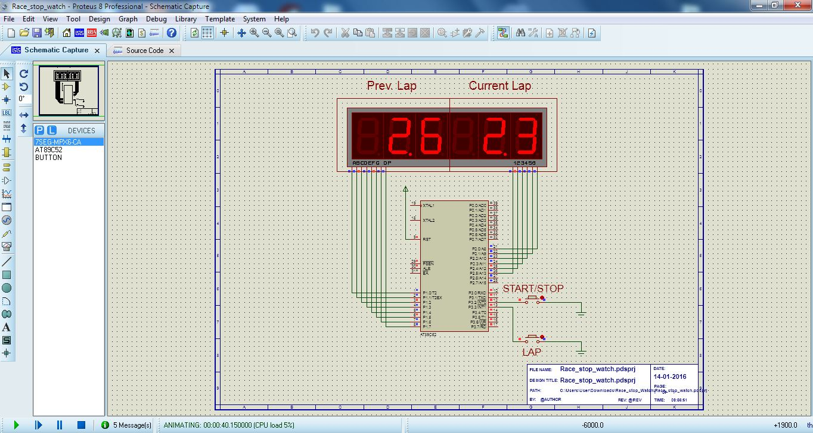

# Race Stop Watch

Open `race_stop_watch.pdsprj` using Proteus 8. Just click play button to run the simulation.

Code can be compiled with either Keil µVision IDE (C51) or SDCC
- Keil µVision IDE (C51) 
    - Download and install [Keil C51](http://www.keil.com/c51/)
    - Open `Race_stop_watch.uvproj` and click `Build`
- SDCC 
    - Install [SDCC](http://sdcc.sourceforge.net/)
        - Windows - Get [MSYS2](https://www.msys2.org/) and SDCC 
          [32-bit installer](https://sourceforge.net/projects/sdcc/files/snapshot_builds/i586-mingw32msvc-setup/)/ 
          [64-bit installer](https://sourceforge.net/projects/sdcc/files/snapshot_builds/x86_64-w64-mingw32-setup/)
        - Debian based (Eg: Ubuntu) - `sudo apt install sdcc`
        - macOS - `brew install sdcc`
    - Run `make`

Use the generated HEX file `Race_stop_watch.hex` to run the Proteus simulation.

---

## Changelog

- March 2016 - Initial version
- December 2019 - Added support for SDCC
